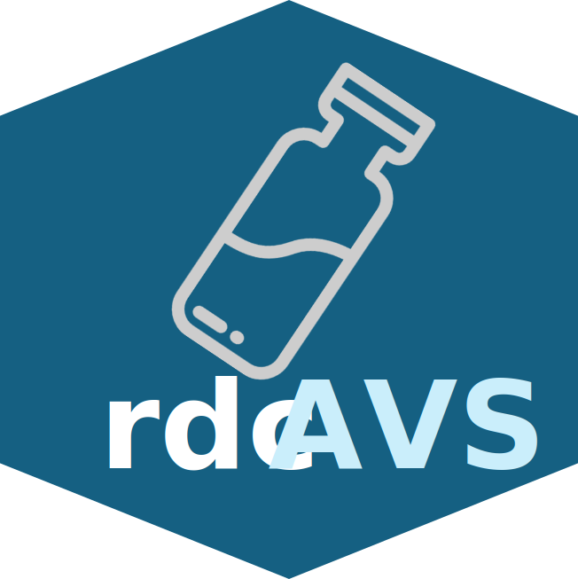

rdcAVS
================
Mervin Keith Cuadera

<!-- README.md is generated from README.Rmd. Please edit that file -->

<!-- badges: start -->
<!-- badges: end -->

The goal of rdcAVS is to streamline the process of creating SIA campaign
folders. The package is designed to be portable and secure. Data for the
geographies and permissions are stored locally and are uploaded by the
user directly. Currently, the package comes with the campaign template,
but future versions will allow users to upload their own modified
campaign template file.

## Installation

You can install the development version of rdcAVS from
[GitHub](https://github.com/) with:

``` r
# install.packages("pak")
pak::pak("mcuadera/rdcAVS")
```

## Example

To run the app, simply run the following code:

``` r
library(rdcAVS)

## basic example code
campagneApp()
```
